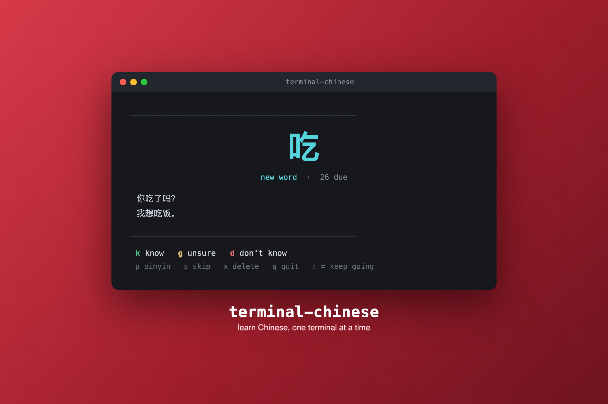

<p align="center">
  
</p>

<h1 align="center">terminal-chinese 🇨🇳</h1>

<p align="center">
  Learn Chinese vocabulary in your terminal. A card appears every time you open a shell;<br>
  answer with one keystroke and <a href="https://github.com/open-spaced-repetition/py-fsrs">FSRS</a> spaced repetition schedules the next review.
</p>

<p align="center">
  <a href="https://terminal-chinese.lansford.dev"><b>terminal-chinese.lansford.dev</b></a> — try the live demo
  &nbsp;·&nbsp; If you want to donate to support :)&nbsp;
  <a href="https://buy.stripe.com/00wcN46fZ2du8f9a7cc7u01"><b>$3/month (editable)</b></a>
</p>

---

Answer a card and it reveals pinyin, meaning, mnemonic, etymology, translated examples, measure word, and related words — then tells you when you'll see it again.

## Features

- **FSRS spaced repetition** — modern scheduling via [py-fsrs](https://github.com/open-spaced-repetition/py-fsrs)
- **Terminal-startup reviews** — one card per new terminal, ~80ms to first paint
- **AI vocabulary generation** — `ct add hello`, `ct add-many 'food words'`, `ct generate` (Claude API)
- **Auto-import** — drop `{"vocabulary": [...]}` JSON files into a folder, they import on next review
- **HSK 1–6 vocab packs** ship in the box, starting on HSK 1 — widen anytime with `ct config --hsk`
- **Progress tracking** — `ct stats` and `ct graph`
- Simplified + traditional characters, pinyin hide/reveal

## Install

**One step (macOS & Linux)** — installs and hooks your shell for you:

```sh
curl -fsSL https://raw.githubusercontent.com/wylansford/terminal-chinese/main/install.sh | bash
```

**Or with Homebrew** — `brew install` prints the hook to add to `~/.zshrc` (or `~/.bashrc`) as part of its post-install caveats:

```sh
brew install wylansford/tap/terminal-chinese
```

The hook is a few lines that define the `ct` alias and show one card per new terminal window — nothing runs in the background, nothing re-executes itself on every shell. Open a new terminal — HSK 1-6 vocabulary imports automatically. Set `TERMINAL_CHINESE_DISABLE=1` to temporarily silence startup cards.

More vocab packs: `cp data/hsk2/*.json ~/.config/terminal-chinese/vocabulary/`

## Reviewing

`ct review` starts a session manually (terminal startup runs the same thing).

| Key | Action |
|-----|--------|
| `k` | I know it (Easy) |
| `g` | Not sure (Hard) |
| `d` | Don't know (Again) |
| `p` | Toggle pinyin |
| `s` | Skip card |
| `x` | Delete word (with confirmation) |
| `q` / `Enter` / `Esc` | End session |

Answering reveals the full card and ends the session — one keystroke per terminal. Hold **shift** (`K`/`G`/`D`) to keep going: the reveal stays on screen and the next card is dealt below it.

## Adding vocabulary

**AI-generated** (requires `ANTHROPIC_API_KEY`):

```sh
ct add 你好                       # one word from Chinese, English, or a description
ct add-many 'kitchen verbs' --count 15
ct generate 'business vocab' --count 50 --hsk 4 --import
```

**From JSON** — drop files into `~/.config/terminal-chinese/vocabulary/` (imported automatically on next review), or:

```sh
ct import my_words.json
ct export backup.json            # optionally --hsk N
```

## Progress

```sh
ct stats                          # card states, due count, HSK breakdown, 30-day sparkline
ct graph --days 90 --metric reviews_done
```

## Configuration

All 6 HSK packs (~5,700 words) import automatically on first run, but only **HSK 1** is used to introduce new words at first. Change that with:

```sh
ct config --hsk 1,2,3     # draw new words from HSK 1-3
ct config                 # show current config
```

Words you've already started stay on their review schedule no matter how the level changes — this only affects which *new* words get introduced. Under the hood it's `~/.config/terminal-chinese/config.json`:

```json
{ "max_new_cards_per_day": 10, "hsk_levels": [1, 2, 3] }
```

Database lives at `~/.config/terminal-chinese/tutor.db`. Uninstall with `brew uninstall terminal-chinese` or the repo's `uninstall.sh` (offers a backup first).

## License

MIT — see [LICENSE](LICENSE). Free forever, use it however you like. 谢谢！
